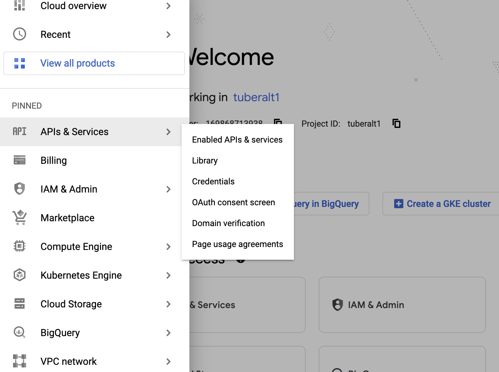
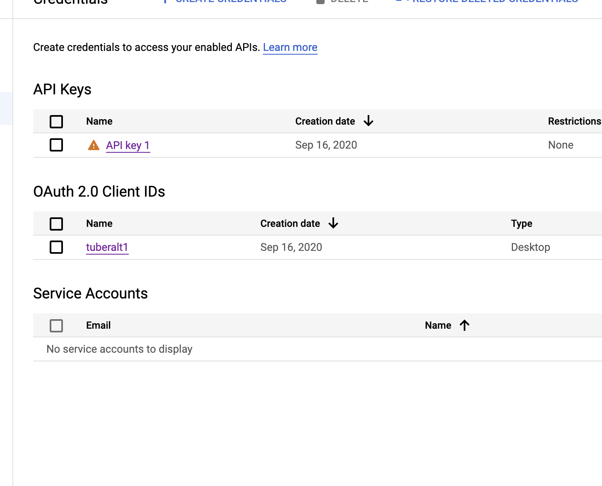
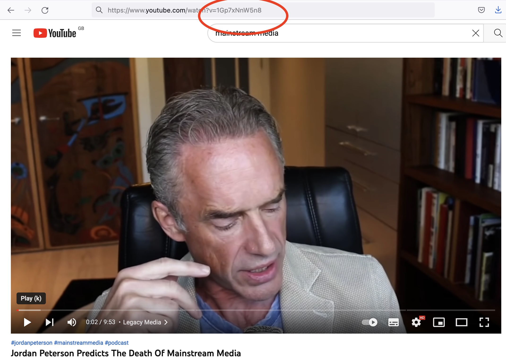

# Exercise 7: Sampling text information

## Introduction

The hands-on exercise for this week focuses on how to collect and/or sample text information. 

In this tutorial, you will learn how to:

* Access text information from online corpora
* Query text information using different APIs
* Scrape text information programmatically
* Transcribe text information from audio
* Extract text information from images

## Online corpora

### Replication datasets

There are large numbers of online corpora and replication datasets available to access freely online. We will first access such an example using the `dataverse` package in R, which allows us to download directly from replication data repositories stored at the [Harvard Dataverse](https://dataverse.harvard.edu/).

```{r, message = F, warning = F}
library(dataverse)
library(dplyr)
```

Let's take an example dataset in which we might be interested: the UK parliamentary speech data from 

We first need to set an en environment variable as so. 

```{r}
Sys.setenv("DATAVERSE_SERVER" = "dataverse.harvard.edu")
```

We can then search out the files that we want by specifying the DOI of the publication data in question. We can find this as a series of numbers and letters that come after "https://doi.org/" as shown below. 

{width=100%}

```{r}
dataset <- get_dataset("10.7910/DVN/QDTLYV")
dataset$files[c("filename", "contentType")]
```

We choose to get the UK data from these files, which is listed under "UK_data.csv." We can then download this directly in the following way (this will take some time as the file size is >1GB).

```{r, eval = F}
data <- get_dataframe_by_name(
  "uk_data.csv",
  "10.7910/DVN/QDTLYV",
  .f = function(x) read.delim(x, sep = ","))

```

Of course, we could also download these data manually, by clicking the buttons at the relevant [Harvard Dataverse](https://dataverse.harvard.edu/)---but it is sometimes useful to build in every step of your data collection to your code documentation, making the analysis entirely programatically reproducible from start to finish.

Note as well that we don't have to search out specific datasets that we already know about. We can also use the `dataverse` package to search datasets or dataverses. We can do this very simply in the following way. 

```{r}
search_results <- dataverse_search("corpus politics text", type = "dataset", per_page = 10)

search_results[,1:3]
```

### Curated corpora

There are, of course, many other sources you might go to for text information. I list some of these that might be of interest below:

- Large English-language corpora: [https://www.corpusdata.org/](https://www.corpusdata.org/)
- Wikipedia data dumps: [https://meta.wikimedia.org/wiki/Data_dumps](https://meta.wikimedia.org/wiki/Data_dumps)
  - English version of dumps [here](https://dumps.wikimedia.org/enwiki/)
- Scottish Corpus of Texts & Speech: [https://www.scottishcorpus.ac.uk/](https://www.scottishcorpus.ac.uk/)
- Corpus of Scottish modern writing: [https://www.scottishcorpus.ac.uk/cmsw/](https://www.scottishcorpus.ac.uk/cmsw/)
- The Manifesto Corpus: [https://manifesto-project.wzb.eu/information/documents/corpus](https://manifesto-project.wzb.eu/information/documents/corpus)
- Reddit Pushshift data: [https://files.pushshift.io/reddit/](https://files.pushshift.io/reddit/)
- Mediacloud: [https://mediacloud.org/](https://mediacloud.org/)
  - R package: [https://github.com/joon-e/mediacloud](https://github.com/joon-e/mediacloud)

**Feel free to recommend any further sources and I will add them to this list, which is intended as a growing index of relevant text corpora for social science research!**

## Using APIs

In order to use the YouTube API, we'll first need to get our authorization token. These can be obtained by anybody, with or without an academic profile (i.e., unlike `academictwitteR`) in previous worksheets.

In order to get you authorization credentials, you can follow this [guide](https://developers.google.com/youtube/v3/getting-started). You will need to have an account on the Google Cloud console in order to do this. The main three steps are to:

1.  create a "Project" on the Google Cloud console;
2.  to associate the YouTube API with this Project;
3.  to enable the API keys for the API

Once you have created a Project (here: called "tuberalt1" in my case) you will see a landing screen like this.


We can then get our credentials by navigating to the menu on the left hand side and selecting credentials:



Now we click on the name of our project ("tuberalt1") and we will be taken to a page containing two pieces of information: our "client ID" and "client secret". 



The client ID is referred to below as our "app ID" in the `tuber` packaage and the client secret is our "app secret" mentioned in the `tuber` package.


Once we have our credentials, we can log them in our R environment with the `yt_oauth` function in the `tuber` package. This function takes two arguments: an "app ID" and an "app secret". Both of these will be provided to you once you have associated the YouTube API with your Google Cloud console project.

## Getting YouTube data

In the paper by @haroon2022, the authors analyze the recommended videos for a particular used based on their watch history and on a seed video. In the below, we won't replicate the first step but we will look at the recommended videos that appear based on a seed video.

In this case, our seed video is a video by Jordan Peterson predicting the death of mainstream media. This is fairly "alternative" content and is actively taking a stance against mainstream media. So does this mean YouTube will learn to recommend us *away* from mainstream content?

```{r, eval = F}
library(tidyverse)
library(readxl)
library(tuber)

yt_oauth("431484860847-1THISISNOTMYREALKEY7jlembpo3off4hhor.apps.googleusercontent.com","2niTHISISMADEUPTOO-l9NPUS90fp")

#get related videos
startvid <- "1Gp7xNnW5n8"
rel_vids <- get_related_videos(startvid, max_results = 50, safe_search = "none")
```

In the above, we first take the unique identifying code string for the video. You can find this in the url for the video as shown below.



We can then collect the videos recommended on the basis of having this video as the seed video. We store these as the data.frame object `rel_vids`.

And we can have a look at the recommended videos on the basis of this seed video below.

```{r, echo = F, eval = T}
library(rmarkdown)
rel_vids <- readRDS("data/sampling/ytvids_recommended.rds")
paged_table(rel_vids)
```

It seems YouTube recommends us back a lot of videos relating to Jordan Peterson. Some of these are from more mainstream outlets; others are from more obscure sources.

## Questions

1.  Make your own request to the YouTube API for a different seed video.

2.  Collect one video ID for each of the channels included in the resulting data

3.  Write a for loop to collect recommended videos for each of these video IDs

### Other APIs (R packages)

- [https://cran.r-project.org/web/packages/manifestoR/index.html](https://cran.r-project.org/web/packages/manifestoR/index.html)
- [https://cran.r-project.org/web/packages/academictwitteR/index.html](https://cran.r-project.org/web/packages/academictwitteR/index.html)
- [https://cran.r-project.org/web/packages/vkR/vkR.pdf](https://cran.r-project.org/web/packages/vkR/vkR.pdf)

## Scraping

To practice this skill, we will use a series of webpages on the Internet Archive that host material collected at the Arab Spring protests in Egypt in 2011. The original website can be seen [here](https://www.tahrirdocuments.org/) and below.

{width=100%}

Before proceeding, we'll load the remaining packages we will need for this tutorial.

```{r, message=F}
library(tidyverse) # loads dplyr, ggplot2, and others
library(ggthemes) # includes a set of themes to make your visualizations look nice!
library(readr) # more informative and easy way to import data
library(stringr) # to handle text elements
library(rvest) #for scraping
```

We can download the final dataset we will produce with:

```{r}
pamphdata <- read_csv("data/sampling/pamphlets_formatted_gsheets.csv")
```

You can also view the formatted output of this scraping exercise, alongside images of the documents in question, in Google Sheets [here](https://docs.google.com/spreadsheets/d/1rg2VTV6uuknpu6u-L5n7kvQ2cQ6e6Js7IHp7CaSKe90/edit?usp=sharing).

If you're working on this document from your own computer ("locally") you can download the Tahrir documents data in the following way:

```{r, eval = F}
pamphdata <- read_csv("https://github.com/cjbarrie/CTA-ED/blob/main/data/sampling/pamphlets_formatted_gsheets.csv")

```

Let's have a look at what we will end up producing:


```{r}
head(pamphdata)
```

We are going to return to the Internet Archived webpages to see how we can produce this final formatted dataset. The archived Tahrir Documents webpages can be accessed [here](https://wayback.archive-it.org/2358/20120130143023/http://www.tahrirdocuments.org/).

We first want to expect how the contents of each webpage is stored.

When we scroll to the very bottom of the page, we see listed a number of hyperlinks to documents stored by month:


We will click through the documents stored for March and then click on the top listed pamphlet entitled "The Season of Anger Sets in Among the Arab Peoples." You can access this [here](https://wayback.archive-it.org/2358/20120130161341/http://www.tahrirdocuments.org/2011/03/voice-of-the-revolution-3-page-2/).

We will store this url to inspect the HTML it contains as follows:

```{r}
url <- "https://wayback.archive-it.org/2358/20120130161341/http://www.tahrirdocuments.org/2011/03/voice-of-the-revolution-3-page-2/"

html <- read_html(url)

html
```

Well, this isn't particularly useful. Let's now see how we can extract the text contained inside.

```{r}
pagetext <- html %>%
  html_text()

pagetext
```

Well this looks pretty terrifying now...

We need a way of quickly identifying where the relevant text is so that we can specify this when we are scraping. The most widely-used tool to achieve this is the "Selector Gadget" Chrome Extension. You can add this to your browser for free [here](https://chrome.google.com/webstore/detail/selectorgadget/mhjhnkcfbdhnjickkkdbjoemdmbfginb?hl=en). 

The tool works by allowing the user to point and click on elements of a webpage (or "CSS selectors"). Unlike alternatives, such as "Inspect Element" browser tools, we are easily able to see how the webpage item is contained within CSS selectors (rather than HTML tags alone), which is easier to parse. 

We can do this with our Tahrir documents as below:

{width=100%}

So now we know that the main text of the translated document is contained between "p" HTML tags. To identify the text between these HTML tags we can run:

```{r}
pagetext <- html %>%
  html_elements("p") %>%
  html_text(trim=TRUE)

pagetext
  
```

, which looks quite a lot more manageable...! 

What is happening here? Essentially, the `html_elements()` function is scanning the page and collecting all HTML elements contained between `<p>` tags, which we collect using the "p" CSS selector. We are then just grabbing the text contained in this part of the page with the `html_text()` function. 

So this gives us one way of capturing the text, but what about if we wanted to get other elements of the document, for example the date or the tags attributed to each document? Well we can do the same thing here too. Let's take the example of getting the date:

{width=100%}

We see here that the date is identified by the ".calendar" CSS selector and so we enter this into the same `html_elements()` function as before:

```{r}
pagedate <- html %>% 
  html_elements(".calendar") %>%
  html_text(trim=TRUE)

pagedate
  
```

Of course, this is all well and good, but we also need a way of doing this at scale---we can't just keep repeating the same process for every page we find as this wouldn't be much quicker than just copy pasting. So how can we do this? Well we need first to understand the URL structure of the website in question.

When we scroll down the page we see listed a number of documents. Each of these directs to an individual pamphlet distributed at protests during the 2011 Egyptian Revolution. 

Click on one of these and see how the URL changes.

We see that if our starting URL was:

```{r, echo=F}
starturl <- "https://wayback.archive-it.org/2358/20120130135111/http://www.tahrirdocuments.org/"
```

```{r, echo=F, comment=NA}
cat(starturl)
```

Then if we click on March 2011, the first month for which we have documents, we see that the url becomes:

```{r, echo=F}
marchurl <- "https://wayback.archive-it.org/2358/20120130143023/http://www.tahrirdocuments.org/2011/03/"
 
augusturl <- "https://wayback.archive-it.org/2358/20120130142155/http://www.tahrirdocuments.org/2011/08/"

jan2012url <- "https://wayback.archive-it.org/2358/20120130142014/http://www.tahrirdocuments.org/2012/01/"

```

```{r, echo=F, comment=NA}
cat(marchurl)
```

, for August 2011 it becomes:

```{r, echo=F, comment=NA}
cat(augusturl)
```

, and for January 2012 it becomes:

```{r, echo=F, comment=NA}
cat(jan2012url)
```

We notice that for each month, the URL changes with the addition of month and year between back slashes at the end or the URL. In the next section, we will go through how to efficiently create a set of URLs to loop through and retrieve the information contained in each individual webpage.

We are going to want to retrieve the text of documents archived for each month. As such, our first task is to store each of these webpages as a series of strings. We could do this manually by, for example, pasting year and month strings to the end of each URL for each month from March, 2011 to January, 2012:

```{r}
url <- "https://wayback.archive-it.org/2358/20120130143023/http://www.tahrirdocuments.org/"

url1 <- paste0(url,"2011/03/")
url2 <- paste0(url,"2011/04/")
url3 <- paste0(url,"2011/04/")

#etc...

urls <- c(url1, url2, url3)
    
```

But this wouldn't be particularly efficient...

Instead, we can wrap all of this in a loop. 

```{r}
urls <- character(0)
for (i in 3:13) {
  url <- "https://wayback.archive-it.org/2358/20120130143023/http://www.tahrirdocuments.org/"
  newurl <- ifelse(i <10, paste0(url,"2011/0",i,"/"), 
                   ifelse(i>=10 & i<=12 , paste0(url,"2011/",i,"/"), 
                          paste0(url,"2012/01/")))
  urls <- c(urls, newurl)
}
```

What's going on here? Well, we are first specifying the starting URL as above. We are then iterating through the numbers 3 to 13. And we are telling R to take the new URL and then, depending on the number in the loop we are on, to take the base starting url--- `r url` --- and to paste on the end of it the string "2011/0", then the number of the loop we are on, and then "/". So, for the first "i" in the loop---the number 3---then we are effectively calling the equivalent of:

```{r}

i <- 3

url <- "https://wayback.archive-it.org/2358/20120130143023/http://www.tahrirdocuments.org/"

newurl <- paste0(url,"2011/0",i,"/")
```

Which gives:

```{r, echo=F}
newurl
```

In the above, the `ifelse()` commands are simply telling R: if i (the number of the loop we are on) is less than 10 then `paste0(url,"2011/0",i,"/")`; i.e., if i is less than 10 then paste "2011/0", then "i" and then "/". So for the number 3 this becomes:

`"https://wayback.archive-it.org/2358/20120130143023/http://www.tahrirdocuments.org/2011/03/"` 

, and for the number 4 this becomes 

`"https://wayback.archive-it.org/2358/20120130143023/http://www.tahrirdocuments.org/2011/04/"`

If, however, `i>=10 & i<=12` (i is greater than or equal to 10 and less than or equal to 12) then we are calling `paste0(url,"2011/",i,"/")` because here we do not need the first "0" in the months. 

Finally, if (else) i is greater than 12 then we are calling `paste0(url,"2012/01/")`. For this last call, notice, we do not have to specify whether i is greater than or equal to 12 because we are wrapping everything in `ifelse()` commands. With `ifelse()` calls like this, we are telling R if x "meets condition" then do y, otherwise do z. When we are wrapping multiple `ifelse()` calls within each other, we are effectively telling R if x "meets condition" then do y, or if x "meets other condition" then do z, otherwise do a. So here, the "otherwise do a" part of the `ifelse()` calls is saying: if i is not less than 10, and is not between 10 and 12, then paste "2012/01/" to the end of the URL.

Got it? I didn't even get it on first reading... and I wrote it. The best way to understand what is going on is to run this code yourself and look at what each part is doing.

So now we have our list of URLs for each month. What next?

Well if we go onto the page of a particular month, let's say March, we will see that the page has multiple paginated tabs at the bottom. Let's see what happens to the URL when we click on one of these:

```{r, echo=F}
marchurl <- "https://wayback.archive-it.org/2358/20120130143023/http://www.tahrirdocuments.org/2011/03/"
marchurlp2 <- "https://wayback.archive-it.org/2358/20120130163651/http://www.tahrirdocuments.org/2011/03/page/2/"
marchurlp3 <- "https://wayback.archive-it.org/2358/20120130163651/http://www.tahrirdocuments.org/2011/03/page/3/"
```

We see that if our starting point URL for March, as above, was:

```{r, echo=F, comment=NA}
cat(marchurl)
```

When we click through to page 2 it becomes:

```{r, echo=F, comment=NA}
cat(marchurlp2)
```

And for page 3 it becomes:

```{r, echo=F, comment=NA}
cat(marchurlp3)
```

We can see pretty clearly that as we navigate through each page, there appears appended to the URL the string "page/2/" and "page/3/". So this shouldn't be too tricky to add to our list of URLs. But we want to avoid having to manually click through the archive for each month to figure out how many pagination tabs are at the bottom of each page. 

Fortunately, we don't have to. Using the "Selector Gadget" tool again we can automate this process by grabbing the highest number that appears in the pagination bar for each month's pages. The code below achieves this:

```{r, eval=F}

urlpages_all <- character(0) #create empty character string to deposit our final set of urls
urlpages <- character(0) #create empty character string to deposit our urls for each page of each month
for (i in seq_along(urls)) { #for loop for each url stored above
  url <- urls[i] #take the first url from the vector of urls created above
  html <- read_html(url) #read the html
  pages <- html %>%
    html_elements(".page") %>% #grab the page element
    html_text() #convert to text
  pageints <- as.integer(pages) #convert to set of integers
  npages <- max(pageints, na.rm = T) #get number of highest integer
  
  for (j in 1:npages) { #for loop for each of 1:highest page integer for that month's url
  newurl <- paste0(url,"page/",j,"/") #create new url by pasting "page/" and then the number of that page, and then "/", matching the url structure identified above
  urlpages <- c(urlpages, newurl) #bind with previously created page urls for each month
  }
  urlpages_all <- c(urlpages_all, urlpages) #bind the monthly page by page urls together
  urlpages <- character(0) #empty urlpages for next iteration of the first for loop
  urlpages_all <- gsub("page/1/", "", urlpages_all) #get rid of page/1/ as not needed
}
```

```{r, echo=F}
urlpages_all <- readRDS("data/sampling/urlpages_all.RDS")
```

What's going on here? Well, in the first two lines, we are simply creating an empty character string that we're going to populate in the subsequent loop. Remember that we have a set of eleven starting URLs for each of months archived on this webpage. 

So in the code beginning `for (i in seq_along(files)` we saying, similar to above, for the beginning url to the end url, do the following in a loop: first, read in the url with `url <- urls[i]` then read the html it contains with   `html <- read_html(url)`.

After this line, we are getting the pages as a character vector of page numbers by calling the `html_elements()` function on the ".page" tag. this gives a series of pages stored as e.g. "1" "2" "3". 

In order to be able to see how many there are, we need to extract the highest number that appears in this string. To do this, we first need to reformat it as an "integer" object rather than a "character" object so that R can recognize that these are numbers. So we call `pageints <- as.integer(pages)`. Then we get the maximum by simply calling: `npages <- max(pageints, na.rm = T)`. 

In the next part of the loop, we are taking the new information we have stored as "npages," i.e., the number of pagination tabs for each month, and telling R: for each of these pages, define a new url by adding "page/" then the number of the pagination tab "j", and then "/". After we've bound all of these together, we get a list of URLs that look like this:

```{r}
head(urlpages_all)
```

So what next?

The next step is to get the URLs for each of the documents contained in the archive for each month. How do we do this? Well, we can once again use the "Selector Gadget" tool to work this out. For the main landing pages of each month, we see listed, as below, each document in a list. For each of these documents, we see that the title, which links to the revolutionary leaflet in question, has two CSS selectors: "h2" and ".post".

{width=100%}

We can again pass these tags through `html_elements()` to grab what's contained inside. We can then grab what's contained inside these by extracting the "children" of these classes. In essence, this just means a lower level tag: tags can have tags within tags and these flow downwards like a family tree (hence the name, I suppose). 

So one of the "children" of this HTML tag is the link contained inside, which we can get with calling `html_children()` followed by specifying that we want the specific attribute of the web link it encloses with `html_attr("href")`. The subsequent lines then just remove extraneous information. 

The complete loop, then, to retrieve the URL of the page for every leaflet contained on this website is:


```{r, eval =F}
#GET URLS FOR EACH PAMPHLET

pamlinks_all <- character(0)
for (i in seq_along(urlpages_all)) {
  url <- urlpages_all[i]
  html <- read_html(url)
  links <- html_elements(html, ".post , h2") %>%
    html_children() %>%
    html_attr("href") %>%
    na.omit() %>%
    `attributes<-`(NULL)
  pamlinks_all <- c(pamlinks_all, links)
}

```

```{r, echo=F}
pamlinks_all <- readRDS("data/sampling/pamlinks_all.RDS")
```

Which gives us:

```{r}
head(pamlinks_all)

length(pamlinks_all)
```

We see now that we have collected all 523 separate URLs for every revolutionary leaflet contained on these pages. Now we're in a great position to be able to crawl each page and collect the information we need. This final loop is all we need to go through each URL we're interested in and collect relevant information on document text, title, date, tags, and the URL to the image of the revolutionary literature itself.

See if you can work out yourselves how each part of this is fitting together. NOTE: if you want to run the final loop on your own machines it will take several hours to complete. 

```{r, eval=F}

df_empty <- data.frame()
for (i in seq_along(pamlinks_all)) {
  url <- pamlinks_all[i]
  html <- read_html(url)
  cat("Collecting url number ",i,": ", url, "\n")
  
  error <- tryCatch(html <- read_html(url),
                    error=function(e) e)
  if (inherits(error, 'error')) {
    df <- data.frame(title = NA,
                     date = NA,
                     text = NA,
                     imageurl = NA,
                     tags = NA)
    next
  }
  
  df <- data.frame(matrix(ncol=0, nrow=length(1)))
  #get titles
  titles <- html_elements(html, ".title") %>%
    html_text(trim=TRUE)
  
  title <- titles[1]
  df$title <- title
  
  #get date
  date <- html_elements(html, ".calendar") %>%
    html_text(trim=TRUE)
  df$date <- date
  
  #get text
  textsep <-  html_elements(html, "p") %>%
    html_text(trim=TRUE)
  text <- paste(textsep, collapse = ",")
  df$text <- text
  
  #get tags
  pamtags <- html_elements(html, ".category") %>%
    html_text(trim=TRUE)
  df$tags <- pamtags
  
  #get link to original pamphlet image
  elements_other <-  html_elements(html, "a") %>%
    html_children()
  url_element <- as.character(elements_other[2])
  imgurl <- str_extract(url_element, "src=\\S+")
  imgurl <- substr(imgurl, 6, (nchar(imgurl)-1))
  
  df$imageurl <- imgurl
  
  df_empty <- rbind(df_empty, df)
}


```

And now... we're pretty much there...back where we started! 

## Speech to text

There are some R packages that allow the user to connect to the Google Speech-to-Text engine (billing information required to access). You can find such a package [here](https://github.com/ropensci/googleLanguageR) but it doesn't seem to be readily maintained. There is a far wider range of options if you are open to using Python: see, e.g.: [here](https://realpython.com/python-speech-recognition/). 

Here, we're instead going to do the next best thing: capture text that has already been converted from speech. Here, we're going to be collecting the automated English captioning from YouTube videos. For this, we will use the R package `youtubecaption`. Because this package connects to an already existing Python package under the hood, you'll need to have a Conda environment installed. You can download Anaconda Individual Edition [here](https://www.anaconda.com/products/individual).

And to grab the text from a video is as simple as below.

```{r, eval = F}
library(youtubecaption)

url <- "https://www.youtube.com/watch?v=cpbtcsGE0OA"
caption <- get_caption(url)
caption

```

And if you wanted to the same thing in Python you would do the following. 

```{python, eval = F}
!pip install youtube_transcript_api

from youtube_transcript_api import YouTubeTranscriptApi

YouTubeTranscriptApi.get_transcript("cpbtcsGE0OA")
```

## OCR

The last major technique that might be of interest for extracting text is Optical Character Recognition (OCR). This is a technique that reads in image files (e.g., .jpg or .png or .pdf) automatically extracts the text contained therein. 

A very good package in R for extracting text from images is `daiR`, details of which can be found [here](https://cran.r-project.org/web/packages/daiR/index.html). This connects again to the Google Cloud Engine (and thus requires billing info.) but it won't charge you until you've spent your first free $300 of credit. This will take a while to spend so you have a good deal amount of tokens before you start incurring expenses.

You can consult [here](https://dair.info/articles/setting_up_google_storage.html) for info. on setting up your Google Cloud service account. \

Once you have done this you'll be ready to connect to the Google Cloud Engine. 


