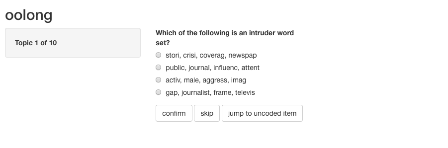

# Exercise 9: Validation

## Introduction

The hands-on exercise for this week focuses on validating text analysis techniques. We'll focus on articles and data that we have already encountered in weeks past and investigate how the authors went about validating their findings.

In this tutorial, you will learn how to:

* Manually review 
* Compare to reference data (@alshaabi_storywrangler_2021)
* Conduct tests for unsupervised approaches
* Conduct tests for supervised approaches

## Setup

Before proceeding, we'll load the packages we will need for this tutorial.

```{r, echo=F}
library(rmarkdown)
library(shiny)
```

```{r, message=F}
library(ggplot2)
library(readr)
library(dplyr)
library(tidytext)
library(stringr)
library(quanteda) 
library(quanteda.textmodels) 
library(oolong) #for topic model validation tasks
```

## Manual review

A first step in any text analysis technique should be to eyeball your data and the results of any analysis you carry out. This might not sound very formalized as an approach---and it isn't---but it is what every good practitioner will find themselves doing at some stage. 

Some refer to this kind of check as a "sanity check." What would such a check look like in practice?

Well, let's take an example from the beginning of the course, where we looked at event descriptions from the Edinburgh International Book Festival. 

We'll first read in this data.

```{r}
edbfdata <- read_csv("data/wordfreq/edbookfestall.csv")
```

As ever, if you're working on this document from your own computer ("locally") you can download the Edinburgh Fringe data in the following way:

```{r, eval = F}
edbfdata <- read_csv("https://github.com/cjbarrie/CTA-ED/blob/main/data/wordfreq/edbookfestall.csv"
```

We'll get the data into tidy format as before, tagging individual words for whether or not they appear in our dictionary of woman- and gender-related terms. One addition here is that we're ascribing each event an individual ID, which will be useful in the next step. 

```{r}
evdes <- edbfdata %>%
  mutate(ID = paste0("EVENT",seq(1:nrow(edbfdata)))) %>%
  select(description, year, ID)

remove_reg <- c("&amp;","&lt;","&gt;","<p>", "</p>","&rsquo", "&lsquo;",  "&#39;", "<strong>", "</strong>", "rsquo", "em", "ndash", "nbsp", "lsquo", "strong", "<p>\n\t")

tidy_des <- evdes %>% 
  mutate(desc = tolower(description)) %>%
  unnest_tokens(word, desc) %>%
  filter(!word %in% remove_reg)

tidy_des$womword <- as.integer(grepl("women|feminist|feminism|gender|harassment|sexism|sexist", 
                                            x = tidy_des$word))

```


Now we can summarise which event IDs have one or more words that appear in our dictionary of reference terms. 

```{r}
tidy_agg <- tidy_des %>%
  group_by(ID) %>%
  summarise(womwords = sum(womword))

womarts <- tidy_agg %>%
  filter(womwords>=1) %>%
  pull(ID)

womdes <- evdes %>%
  filter(ID %in% womarts)

womdes$description <- gsub("<p>\n\t", "", womdes$description)
```

We can then  inspect these. In this instance we have several hundred examples. This kind of number is amenable to manual inspection in full. If that number were larger, we might take a random sample of these articles and inspect this random subsample. 

```{r}
paged_table(womdes)
```

We can now easily inspect these articles and determine whether we are capturing our target concept of interest. Additionally, we may wish to add additional codes to these descriptions based on some qualitative coding procedure. 

## Reference comparison

### Word scaling example

A second technique for determining the validity of data involves comparing to external data with which we might expect to see a close comparison---if our text-based measure is precisely estimated.

A good example of this comes from the week on scaling techniques. Here, the article by @kaneko_estimating_2021 took editorial texts from newspapers to determine whether we could estimate the ideological outlook of these newspapers. In order to determine whether these measures are accurate, however, we need to compare them to some reference data. 

For newspapers, this information might come from expert surveys scoring the bias of newspapers or similar.

We can access data from the first study by @kaneko_estimating_2021 in the following way. 

```{r}
kaneko_dfm <- readRDS("data/wordscaling/study1_kaneko.rds")
```

If you're working locally, you can download the `dfm` data with:

```{r, eval = F}
kaneko_dfm  <- readRDS(gzcon(url("https://github.com/cjbarrie/CTA-ED/blob/main/data/wordscaling/study1_kaneko.rds?raw=true")))
```

As in the previous exervise using these data, the text is in the form a document-feature-matrix. We again remove infrequent words and group at the level of newspaper.

```{r}
table(docvars(kaneko_dfm, "Newspaper"))
## prepare the newspaper-level document-feature matrix
# compress the document-feature matrix at the newspaper level
kaneko_dfm_study1 <- dfm_group(kaneko_dfm, groups = Newspaper)
# remove words not used by two or more newspapers
kaneko_dfm_study1 <- dfm_trim(kaneko_dfm_study1, min_docfreq = 2, docfreq_type = "count")

## size of the document-feature matrix
dim(kaneko_dfm_study1)

```
We'll then estimate the Wordfish model in the same way as in the article by @kaneko_estimating_2021.

```{r}
#### estimate the Wordfish model ####
set.seed(12345)
Study1.wordfish.result <- textmodel_wordfish(kaneko_dfm_study1, sparse = TRUE)

## positions of newspapers
wordfishscores <- data.frame(Newspaper = Study1.wordfish.result$docs, 
                                  score = Study1.wordfish.result$theta)

wordfishscores$method <- "Wordfish"

```

The replication materials for the @kaneko_estimating_2021 article also include the human-coded positions, which can be accessed as follows.

```{r}
# human-coded positions of the newspapers
humancoded.data <- read.csv("data/wordscaling/humancoded_positions.csv")
```

Or you can download these locally as follows.

```{r, eval = F}
humancoded.data  <- readRDS(gzcon(url("https://github.com/cjbarrie/CTA-ED/blob/main/data/wordscaling/humancoded_positions.csv?raw=true")))
```

We take the mean of the human-coded positions, aggregating across dates and coders for all newspapers. 
```{r}
## human-coded positions
# average of editorial positions coded by three coders
humancoded.data$Ideology <- (humancoded.data$CoderA + 
                               humancoded.data$CoderB + 
                               humancoded.data$CoderC) / 3

humanscores <- humancoded.data %>%
  group_by(Newspaper) %>%
  summarise(score = mean(Ideology))

humanscores$method <- "Human-coded"
```

We then bind our Wordfish and human-coded scores into one data frame and we are ready to plot. 

```{r}
wordfish.human.positions <- rbind(wordfishscores, humanscores)

wordfish.human.positions %>%
  ggplot() +
  geom_point(aes(Newspaper, score, color = method)) + 
  coord_flip() +
  theme_minimal()
```

## Unsupervised learning checks

In the example worksheet for topic modelling, we encountered several tests included in the `preText` package to validate pre-processing steps for our topic models. 

Another article, by @ying_topics_2021, describes several additional tests we might conduct to validate our model output. 

These include:

1. Word lists
2. Fit statistics
3. Additional (qualitative) coding
4. Human coders
  - Word intrusion (identify the most irrelevant word)
  - Word set intrusion (identify lowest probability topic word sets for a document)
  - Label intrusion
  - Optimal label selection
  
A very good package for implementing some of these procedures is `oolong` by  Chung-Hong Chan.

You can find details of the package [here](https://www.theoj.org/joss-papers/joss.02461/10.21105.joss.02461.pdf) and [here](https://cran.r-project.org/web/packages/oolong/oolong.pdf). For intrusion-type tasks, the package allows the user to easily launch interactive windows to complete the tasks and record the data.
 
We take here an example from scientific abstracts data bundled in the package. We then generate a "Shiny" app---basically an R-based form of interactice UIs. 

```{r, eval = F}
wsi_test <- wsi(abstracts_keyatm)
wsi_test
export_oolong(wsi_test, dir = "data/validation/wsi_test/", use_full_path = FALSE)
```

To launch the the Shiny app generated by the `export_oolong()` call, we simply do the following, pointing to the same directory we used to save our exported oolong app. 

```{r, eval = FALSE}
shiny::runApp("data/validation//wsi_test")
```

And we should see a window that looks something like this. 

{width=50%}